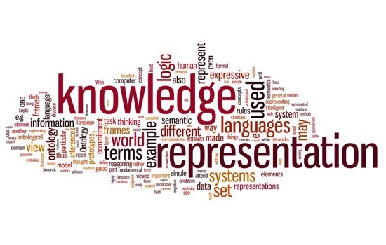
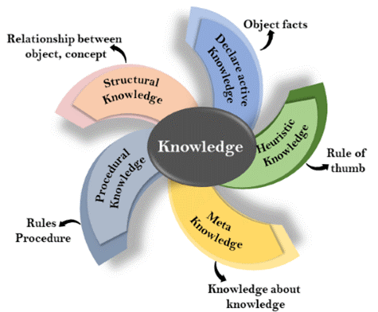
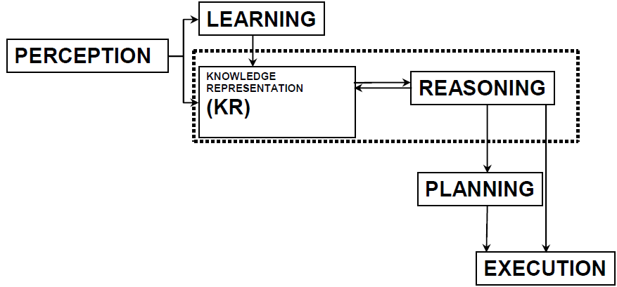
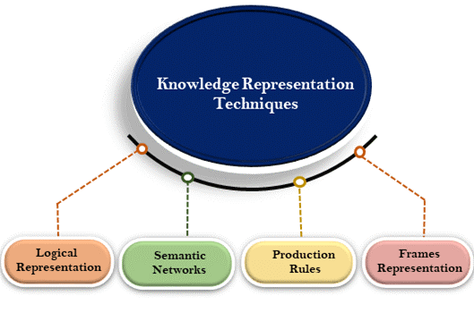
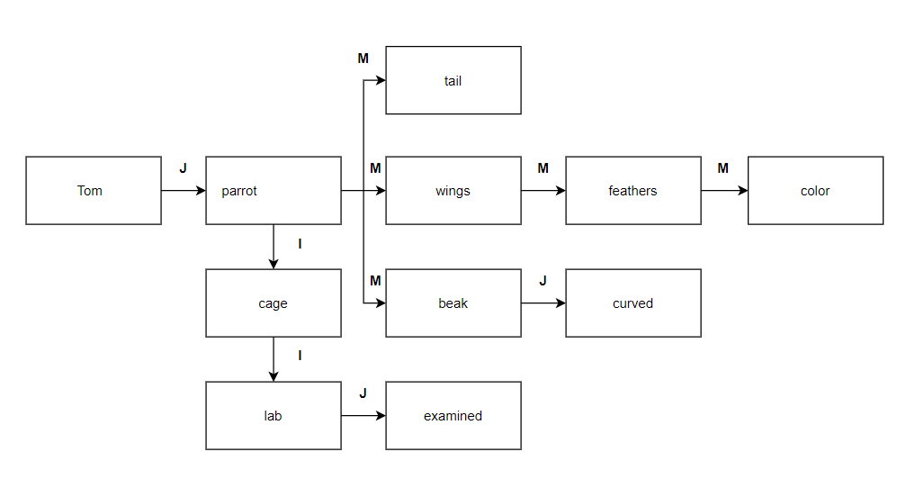

# Knowledge representation

Not from now on we know that the human mind can be irreplaceable. It is necessary for us to acquire knowledge, to analyse it, to understand it.  What is more, it allows us to make decisions in everyday situations also by understanding the subject and quickly draw conclusions, as a result of which we make decisions whether they are always correct, everyone can judge for themselves. 
While we sometimes have our own doubts as to what decision should be taken in certain situations, how is it possible that machines face a similar situation? 

I would like to draw attention to the representations of knowledge in artificial intelligence, but above all to how artificial intelligence affects machines and allows them to function like humans, making various decisions and facing everyday challenges.

## What is Knowledge Representation and Reasoning?
In simple terms, Knowledge Representation in Ai describes the representation of knowledge. It is a field of science that is about how to translate knowledge, reasoning, conviction, an intelligent agent into automated inference processes.

Knowledge representation presents information from the real world in a way that is understandable to the computer, allowing it to solve complex problems such as the communication between the machine and the human being. It is worth noting that this does not only consist of a simple storage of data in a database but also of enabling the machine to learn from it. 

###### We distinguish 5 types of Knowledge

### Cycle of Knowledge Representation in AI

###### Artificial intelligence systems consist of various elements to best express their behaviour, we include them

1.	Perception
2.	Learning
3.	Knowledge Representation & Reasoning
4.	Planning
5.	Execution
 
In the diagram above we can see what the relationship between the AI system and the real world looks like and what elements are included in it.
Perception allows the system to collect information from the environment. As in the case of a human being, it can be a visual or audible stimulus or any other information. It then defines how to proceed if any of the information is detected. 

The learning component learns from the data collected by the percept. The art is to create computers that can be taught rather than programmed. Here also the aspect of learning/improving itself appears. 

Knowledge representation and reasoning is the main element in this cycle. It shows human like intelligences in machines. Everything at some stage comes down to understanding intelligence. The whole art is to focus on what an agent needs to be intelligent instead of focusing on building and understanding the brain from scratch, this is crucial because it allows us to focus on improving and developing instead of repeating and copying the basics, we have available.

The last two elements, planning and execution are responsible for analysis and reasoning. Planning includes the initial states and conditions under which we try to achieve the expected results. After this stage is completed, all we have to do is execute the whole process.

## What is the Relation between Knowledge & Intelligence?
Undoubtedly, both knowledge in intelligence and the creation of artificial intelligence itself play a key role. This shows us intelligent behaviour not only of agents but also of systems. In order for an agent, or a system, to be able to behave in the way we expect it to behave, it must have the necessary knowledge and experience in the given matter.

The difference between knowledge and intelligence is key here. We can say that knowledge is a combination of skills, information that a person has acquired through experience. 

In turn intelligence is the ability to complicate this knowledge in some sense. For example, if someone does not have knowledge about a given topic, it does not mean that he/she cannot put his/her intelligence into solving the problem.

## Techniques of Knowledge Representation in AI

###### We distinguish 4 techniques used in knowledge representation, namely

###### Now let's take a little more detailed look at them.

### Logical Representation 
A very common method of knowledge representation is the representation of logic-based models. Classical logic is the basic tool that allows for some automation of the process of applying and acquiring knowledge. However, in specific applications, where an expert system is required to be flexible and resistant to uncertain input data, this system has in many cases proved to be less useful in comparison with systems based on other methods.

From a logic point of view, the state's knowledge of a set of rules and facts. Adding a tongue, you get theories, that is, some codified, ordered image of a certain class of objects presented with the help of words, formulas, rules and grammar of arbitrarily adopted tongue. It should be stressed that the language is an abstract structure consisting of a dictionary and grammar, allowing it to operate on symbols. It is a syntax of a given system.

Semantics, in turn, gives meaning to expressions created according to the grammar. By adding a deductive structure to the language, one probably obtains a conclusion mechanism that enables the theory to function productively. This allows us to anticipate future states of the system on the basis of observations and facts and to create certain generalizations on the basis of the observed correctness.

### Semantic Network Representation
A semantic network is a generalised concept of a statement network, which assumes that the nodes correspond to complete descriptions of concepts or objects and are not just statements.

There is a kind of logic where relations between objects are presented as a drawing.

In semantic networks, the inference corresponds to "moving" in the graph. Different conclusions are drawn from the network inspection. So, it's like a deduction mechanism.

The above network called Tom creates a directed graph. Between the individual nodes of the graph there are relations: J - is, M - have, I - is in. The directed graph means that the relations are in one direction. For example, between the nodes Tom and the parrot there is a "is" relationship. So, from the graph you can derive a statement. Tom is a parrot. However, it is not possible to deduce the opposite: the parrot is Tom, which would mean that parrots belong to a class called Tom.

The model of knowledge representation through semantic networks also has its disadvantages. The problem here is, for example, whether the network nodes are a single object or a class of objects. Therefore, these networks are usually associated with frames or rules. Frameworks in this approach correspond to objects and describe their internal structure, semantic networks to relationships between frames.

There may also be some deductive traps in the semantic network. In the example we can deduce: Tom is being examined. This statement does not have to be true. The truthfulness of this statement can occur when Tom is in the laboratory.

The semantic network method is often used in systems of analysis and understanding of natural language. This is due to the clarity with which intricate syntactic structures of language can be represented with this representation. Semantic networks are also useful for translation from one language into another and for learning support.

### Frame Representation
Frames enable declarative and procedural representation of knowledge.

They provide an opportunity to organise the knowledge base in such a way that the rules representing the knowledge of a given field are clearly separated from the rules necessary for the proper functioning of the expert system.

They provide the opportunity to group information on a selected piece of knowledge in a single framework, which simplifies subsequent verification.

A frame is a structure that describes a given object and consists of procedures, so-called cages, also called slots. Each frame represents a property or feature of the object described by the frame. 

Frames are similar to the representation of knowledge by the statements: <object> <attribute> <value>. In this case, however, it is a broader description, since the value written in a frame is one of many possible elements of a frame. The cage is divided into smaller parts – facets.
 
Every frame, cage and facet must have a name. There must not be two frames with the same name in a frame, nor must there be two facets with the same name in a frame. 

However, different frames may have the same type of frames, the same applies to facets. They can be numbers, texts, pictograms or consecutive frames. The actual data, written directly into the frame, is called the frame value, which is written into a VALUE facet.

In general, each cage is assigned a specific set of facets in which, for example, the conditions for recognising the value of an attribute as a limit value, the procedure for obtaining the value, etc., can be stored.

###### Overview of the framework
  
  

### Basic characteristics of the framework
- Frame is a data structure that describes a certain object or class of objects and offers access to full information about that object.
- Frame is a set of cages. All information about the object, contained in the frame, is divided into parts which are values of frames.
- Each frame corresponds to a certain property of a given object and is of a specific type, i.e. it has a defined domain of values that can be placed in it.
- Depending on the value domain contained in a frame, there are different frame types. A frame is unambiguously defined by specifying its type as well as which frame it belongs to.
- The values of the cage may vary. In particular, the frame value can be a reference to another frame or any procedure or function.
- Cages are additionally divided into facets, containing selected cage values.
- Frames, cages and facets are identified by their names.

Each frame can contain multiple facet types, each of which is either a certain frame value or a certain function

## Production rules
Among the various methods of knowledge representation, rule-based methods play an important role. It can be noted that a set of statements is not sufficient to describe a field of knowledge. There is still a need for rules, whose general form can be expressed as:

IF condition THEN conclusion

IF condition THEN action

###### Example:
IF temp = high THEN flu = yes

IF temp = normal THEN flu = no

The premise may contain a number of statements connected by logical functions. Note that the uncontrolled growth of the knowledge base with redundant tautologies does not occur in rule-based systems. The knowledge base in this case contains a set of rules and a set of facts. The ability to represent the world is limited to the above sentence structures.

###### Bibliography:

[1] https://www.edureka.co/blog/knowledge-representation-in-ai/

[2] https://www.javatpoint.com/knowledge-representation-in-ai

[3] https://www.skedsoft.com/books/artificial-intelligence/the-ai-cycle

[4] https://medium.com/@mdsaife245/knowledge-representation-and-reasoning-chapter-1-basic-gyaan-about-knowledge-representation-7630fdaa5a53

[5] https://wydawnictwo.us.edu.pl/node/18233

[6] https://wydawnictwo.us.edu.pl/sites/wydawnictwo.us.edu.pl/files/systemy_ekspertowe_czw_st.pdf

